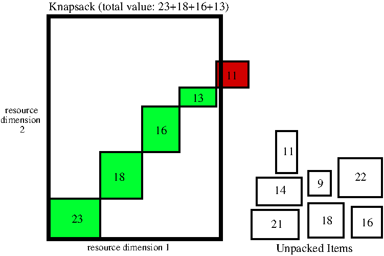

# Knapsack Problem N-dimensional

This repository contains different solvers for N-dimensional Knapsack
problems implemented in Java. A two dimensional Knapsack problem can
be visualized as:



The goal in a knapsack problem is to pack a number of items from a
given set in the knapsack in such a way that the total values off all
packed items is maximized. Each item, independent from its value,
requires resources to pack and the total number of resources over all
packed items may not exceed the resource capacity of the knapsack (as
indicated in red).


## Build

To build the solvers use the Makefile:

```
 make
```

## Run

Three different solvers are provided. 

##### depth_first solver

The dept-first solver systematically tries all different ways of
packing the items in the knapsack. It therefore finds the best
possible packing but is also very slow when the number of items is
large as the search time grows exponentially with the number of
items. Run this solver and view its log with:

```
 java Main -solver depth_first
```

##### hill_climbing solver

The hill_climbing solver starts with a randomly packed knapsack and
each iteration it tries to first unpack N random items from the
knapsack and second tries to pack the knapsack with all items that are
not packed in a random order. If after this unpack-and-pack action the
total value increases or stays the same it will accept this new
knapsack. If however the total value decreases it will reject the new
knapsack and undo the last unpack-and-pack action. Given enough iteration
this solver will hopefully find a good solution. This solver can solve
problems with a large number of items in reasonable time. However due
to its randomness it is not guaranteed to find the best possible
solution. Run this solver and view its log with:

```
 java Main -solver hill_climbing
```

##### simulated_annealing solver

The simulated_annealing solver is the same as the hill_climbing solver
except that it now has a chance of accepting a knapsack even after the total
value of the knapsack decreased. This chance is a function of the
amount of total value decrease and the current temperature. In the
beginning of the search the temperature is high and the chance of
accepting a knapsack with a certain decrease is high. As the temperature
drops linearly to zero towards the end of the search the chance gets
lower and lower. When at the end the chance is close to zero
simulated_annealing will behave as the hill_climbing does, not
accepting any decrease in value. Run this solver and view its log
with:

```
 java Main -solver simulated_annealing
```

## Help

To see what arguments can be given to each solver type:
```
 java Main -help
```

which will give a list similar to:
```
Knapsack solver, arguments:
  -help                                  : show this message
  -verbose <int>                         : verbosity 0=off 1=on, default: 0
  -nr_items <int>                        : number of knapsack items, default: 20
  -dimensions <int>                      : number of resources dimensions, default: 2
  -solver depth_first                    : use the depth_first solver (default)
          hill_climbing                  : use the hill_climbing solver (iterative)
          simulated_annealing            : use the simulated_annealing solver (iterative)
arguments for iterative algorithms:
  -nr_iterations <int>                   : number of iteration, default: 5000000
  -nr_to_unpack <int>                    : number of items to unpack per iteration, default: 1
arguments for simulated annealing:
  -max_temperature <int>                 : max or start temperature, default: 1000
```
## Logs

A run of a solver results in a log file that holds in order:

* parameters used by the solver
* the set of Items that can be packed, each with value and required resources
* the Knapsack with its resource dimensions and all items unpacked (in the 'out' list)
* iterations of the solver, when a higher valued Knapsack is found it is printed

```
verbose:0
nr_items:20
dimensions:2
solver_name:depth_first
nr_iterations:50000
nr_to_unpack:1
max_temperature:1000
Items:
  Item: value:8058 Resources:[5424, 5600]
  Item: value:7106 Resources:[6598, 5734]
  Item: value:5142 Resources:[5687, 7523]
  Item: value:8355 Resources:[6413, 7155]
  Item: value:4895 Resources:[7947, 5229]
  Item: value:7751 Resources:[5392, 6872]
  Item: value:8287 Resources:[4186, 7641]
  Item: value:8894 Resources:[8776, 8048]
  Item: value:7007 Resources:[7304, 6224]
  Item: value:9447 Resources:[7764, 5088]
  Item: value:9075 Resources:[5195, 5194]
  Item: value:7724 Resources:[8775, 5908]
  Item: value:4581 Resources:[9251, 8306]
  Item: value:4454 Resources:[4974, 4625]
  Item: value:4100 Resources:[9110, 5164]
  Item: value:4376 Resources:[4086, 5852]
  Item: value:5343 Resources:[4928, 9124]
  Item: value:6997 Resources:[9755, 5537]
  Item: value:9217 Resources:[5118, 5936]
  Item: value:7494 Resources:[6179, 9287]
Knapsack: value:0 Resources:[84000, 84000] Inventory: in:[] out:[0, 1, 2, 3, 4, 5, 6, 7, 8, 9, 10, 11, 12, 13, 14, 15, 16, 17, 18, 19]
iteration:0 solve_begin_time:1580577059962
iteration:1 time:1580577059973 best_value:0 Knapsack: value:0 Resources:[84000, 84000] Inventory: in:[] out:[0, 1, 2, 3, 4, 5, 6, 7, 8, 9, 10, 11, 12, 13, 14, 15, 16, 17, 18, 19]
iteration:2 time:1580577059988 best_value:8058 Knapsack: value:8058 Resources:[78576, 78400] Inventory: in:[0] out:[1, 2, 3, 4, 5, 6, 7, 8, 9, 10, 11, 12, 13, 14, 15, 16, 17, 18, 19]
iteration:3 time:1580577059989 best_value:15164 Knapsack: value:15164 Resources:[71978, 72666] Inventory: in:[0, 1] out:[2, 3, 4, 5, 6, 7, 8, 9, 10, 11, 12, 13, 14, 15, 16, 17, 18, 19]
iteration:4 time:1580577059989 best_value:20306 Knapsack: value:20306 Resources:[66291, 65143] Inventory: in:[0, 1, 2] out:[3, 4, 5, 6, 7, 8, 9, 10, 11, 12, 13, 14, 15, 16, 17, 18, 19]
iteration:5 time:1580577059989 best_value:28661 Knapsack: value:28661 Resources:[59878, 57988] Inventory: in:[0, 1, 2, 3] out:[4, 5, 6, 7, 8, 9, 10, 11, 12, 13, 14, 15, 16, 17, 18, 19]
iteration:6 time:1580577059989 best_value:33556 Knapsack: value:33556 Resources:[51931, 52759] Inventory: in:[0, 1, 2, 3, 4] out:[5, 6, 7, 8, 9, 10, 11, 12, 13, 14, 15, 16, 17, 18, 19]
iteration:7 time:1580577059989 best_value:41307 Knapsack: value:41307 Resources:[46539, 45887] Inventory: in:[0, 1, 2, 3, 4, 5] out:[6, 7, 8, 9, 10, 11, 12, 13, 14, 15, 16, 17, 18, 19]
iteration:8 time:1580577059989 best_value:49594 Knapsack: value:49594 Resources:[42353, 38246] Inventory: in:[0, 1, 2, 3, 4, 5, 6] out:[7, 8, 9, 10, 11, 12, 13, 14, 15, 16, 17, 18, 19]
iteration:9 time:1580577059989 best_value:58488 Knapsack: value:58488 Resources:[33577, 30198] Inventory: in:[0, 1, 2, 3, 4, 5, 6, 7] out:[8, 9, 10, 11, 12, 13, 14, 15, 16, 17, 18, 19]
iteration:10 time:1580577059990 best_value:65495 Knapsack: value:65495 Resources:[26273, 23974] Inventory: in:[0, 1, 2, 3, 4, 5, 6, 7, 8] out:[9, 10, 11, 12, 13, 14, 15, 16, 17, 18, 19]
iteration:11 time:1580577059990 best_value:74942 Knapsack: value:74942 Resources:[18509, 18886] Inventory: in:[0, 1, 2, 3, 4, 5, 6, 7, 8, 9] out:[10, 11, 12, 13, 14, 15, 16, 17, 18, 19]
iteration:12 time:1580577059990 best_value:84017 Knapsack: value:84017 Resources:[13314, 13692] Inventory: in:[0, 1, 2, 3, 4, 5, 6, 7, 8, 9, 10] out:[11, 12, 13, 14, 15, 16, 17, 18, 19]
iteration:13 time:1580577059990 best_value:91741 Knapsack: value:91741 Resources:[4539, 7784] Inventory: in:[0, 1, 2, 3, 4, 5, 6, 7, 8, 9, 10, 11] out:[12, 13, 14, 15, 16, 17, 18, 19]
iteration:17 time:1580577059990 best_value:96117 Knapsack: value:96117 Resources:[453, 1932] Inventory: in:[0, 1, 2, 3, 4, 5, 6, 7, 8, 9, 10, 11, 15] out:[12, 13, 14, 16, 17, 18, 19]
iteration:47 time:1580577059991 best_value:97688 Knapsack: value:97688 Resources:[3222, 3131] Inventory: in:[0, 1, 2, 3, 4, 5, 6, 7, 8, 9, 10, 13, 18] out:[14, 16, 17, 19, 11, 12, 15]
iteration:875 time:1580577059998 best_value:98405 Knapsack: value:98405 Resources:[1751, 3447] Inventory: in:[0, 1, 2, 3, 4, 5, 6, 7, 9, 10, 11, 13, 18] out:[14, 17, 19, 8, 12, 15, 16]
iteration:2605 time:1580577060005 best_value:99558 Knapsack: value:99558 Resources:[2018, 609] Inventory: in:[0, 1, 2, 3, 4, 5, 6, 8, 9, 10, 11, 18, 19] out:[7, 12, 13, 14, 15, 16, 17]
iteration:39509 time:1580577060039 best_value:100517 Knapsack: value:100517 Resources:[2394, 2452] Inventory: in:[0, 1, 2, 3, 5, 6, 7, 8, 9, 10, 11, 13, 18] out:[14, 16, 17, 19, 4, 12, 15]
iteration:43831 time:1580577060041 best_value:101660 Knapsack: value:101660 Resources:[210, 301] Inventory: in:[0, 1, 2, 3, 5, 6, 8, 9, 10, 11, 17, 18, 19] out:[4, 7, 12, 13, 14, 15, 16]
iteration:100000 time:1580577060058 best_value:101660
iteration:200000 time:1580577060099 best_value:101660
iteration:249356 time:1580577060112 best_value:102869 Knapsack: value:102869 Resources:[1902, 688] Inventory: in:[0, 1, 3, 5, 6, 7, 8, 9, 10, 11, 13, 18, 19] out:[2, 4, 12, 14, 15, 16, 17]
iteration:300000 time:1580577060129 best_value:102869
iteration:400000 time:1580577060161 best_value:102869
iteration:500000 time:1580577060176 best_value:102869
iteration:600000 time:1580577060194 best_value:102869
iteration:700000 time:1580577060208 best_value:102869
iteration:800000 time:1580577060226 best_value:102869
iteration:900000 time:1580577060241 best_value:102869
iteration:1000000 time:1580577060253 best_value:102869
iteration:1100000 time:1580577060265 best_value:102869
iteration:1200000 time:1580577060278 best_value:102869
iteration:1300000 time:1580577060290 best_value:102869
iteration:1400000 time:1580577060300 best_value:102869
iteration:1500000 time:1580577060311 best_value:102869
iteration:1600000 time:1580577060321 best_value:102869
iteration:1700000 time:1580577060331 best_value:102869
iteration:1800000 time:1580577060341 best_value:102869
iteration:1878352 solve_end_time:1580577060349
```

The best Knapsack found has a value of 102869 and holds the Items with index: [0, 1, 3, 5, 6, 7, 8, 9, 10, 11, 13, 18, 19].

## Documentation

To generate documentation of the Java source code use:

```
 make doc
```
afterwards open file "doc/overview-tree.html" in a browser.

## Test

Unit tests for specific classes can be run with:

```
 make test
```

These tests allow to quickly check for possible bugs introduced by new
changes. When writing and testing new code it is highly recommended to
preserve your tests in a separate file and to add it to the unit
tests. This way all previous tests can be run easily after every new
change to the source code which is of great value!